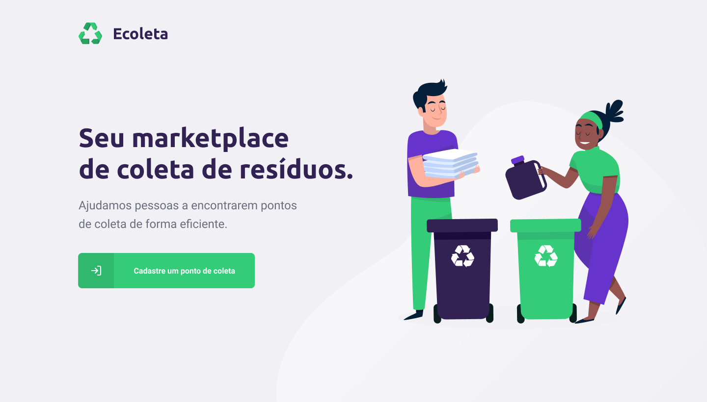
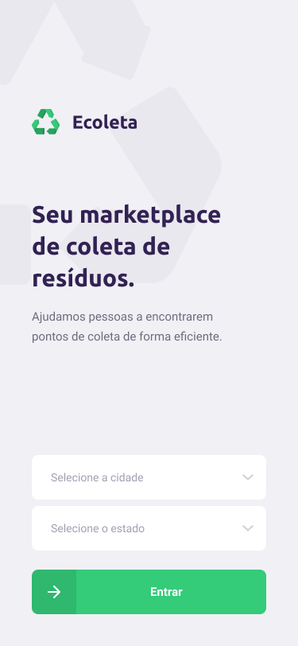

<h1 align="center">
  
</h1>

# Ecoleta

> An React and React native application made for connect people to recyclable collect points.

  
***WEB***

  

***MOBILE***

  

## Table of Contents

- [Installation](#installation)
- [Tecnologies](#tecnologies)
- [Contributing](#contributing)
- [License](#license)

## Installation

1. Clone this repo to your local machine using `https://github.com/caio546/nlw-booster-01`.
2. run `npm install` or `yarn install` in each folder.
3. run `npm run dev` to init the server on your machine.
4. run `npm start` to run the web page on your localhost.
5. run `expo start` to run the app on Expo.
---
## Tecnologies
This applications was built with the following technologies.
- [Type Script](https://www.typescriptlang.org/)
- [Node.js](https://nodejs.org/en/)
- [React](https://reactjs.org)
- [React Native](https://facebook.github.io/react-native/)

## Contributing

### Step 1

- **Option 1**
    - 🍴 Fork this repo!

- **Option 2**
    - 👯 Clone this repo to your local machine.

### Step 2

- **Make your changes!** 🔨🔨🔨

### Step 3

- 🔃 Create a new pull request with detailed information.
---
## License

